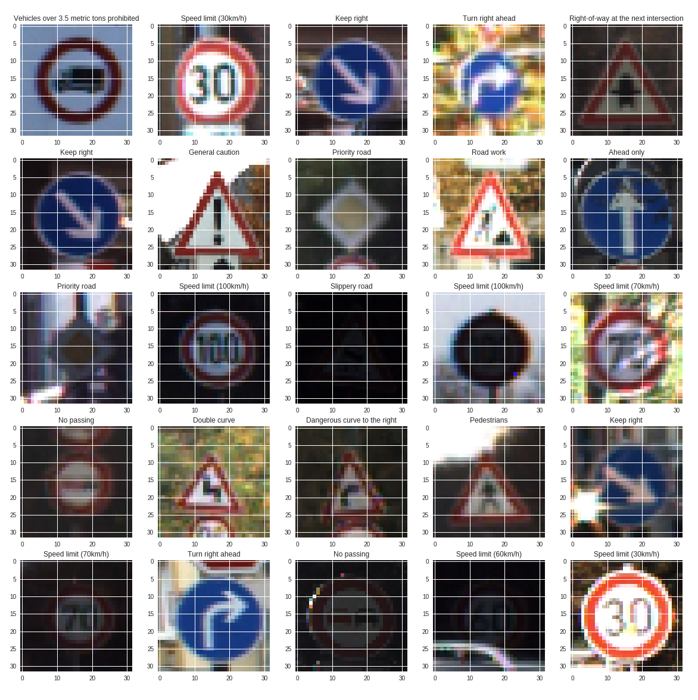
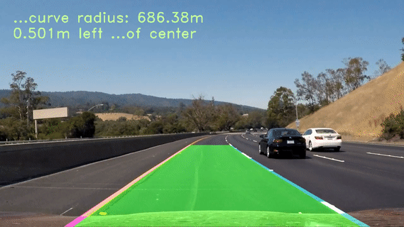
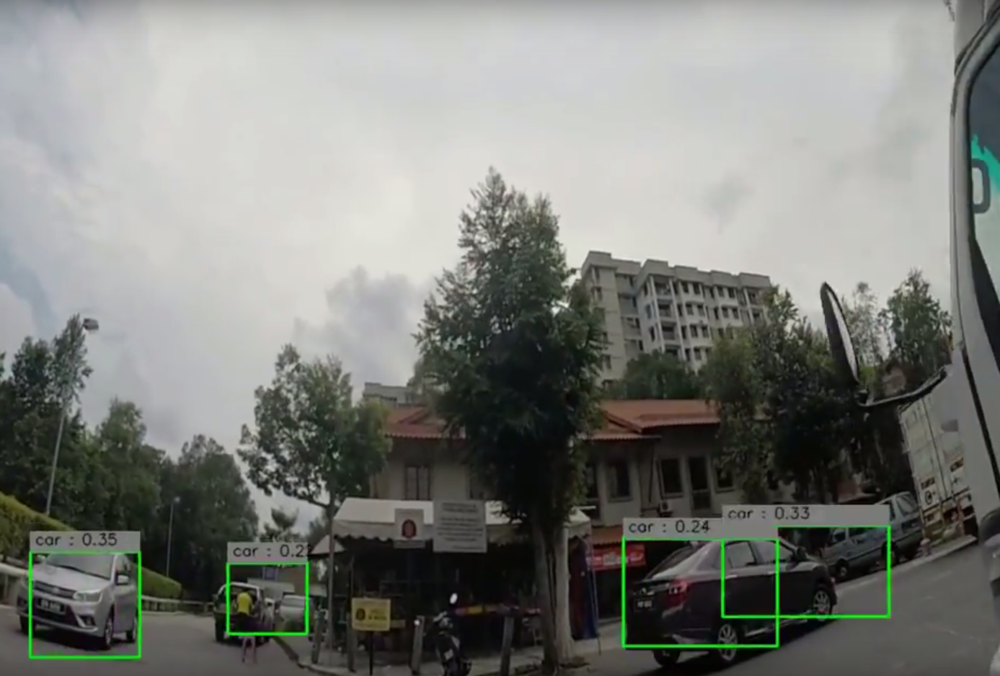

# Self Driving Car Materials
Thanks to Devcon and MIT slides, Shazri, I able to get Udacity self driving car nanodegree materials.

## Simple lane detection

### [Read the notebook here](https://github.com/huseinzol05/Udacity-Nanodegree-SelfDrivingCar/blob/master/Episode1_SimpleLaneDetection/Main-LaneDetection.ipynb)
## Road Sign detection

### [Read the notebook here](https://github.com/huseinzol05/Udacity-Nanodegree-SelfDrivingCar/blob/master/signboard-detection/sign-detection.ipynb)
## Advanced Lane Detection

### [You can watch the video output here](https://youtu.be/_eQ1x-FK6Y4)
### [Read the notebook here](https://github.com/huseinzol05/Udacity-Nanodegree-SelfDrivingCar/blob/master/Advanced-Lane-Detection/Advanced-Lane-Detection.ipynb)
## Object Detection using YOLO

### [You can get the code here](https://github.com/huseinzol05/YOLO-Object-Detection-Tensorflow)
## U-NET, image segmentation

### [You can get the code here](unet)

## SSD with Distance

### [You can get the code here](SSD-Distance)

